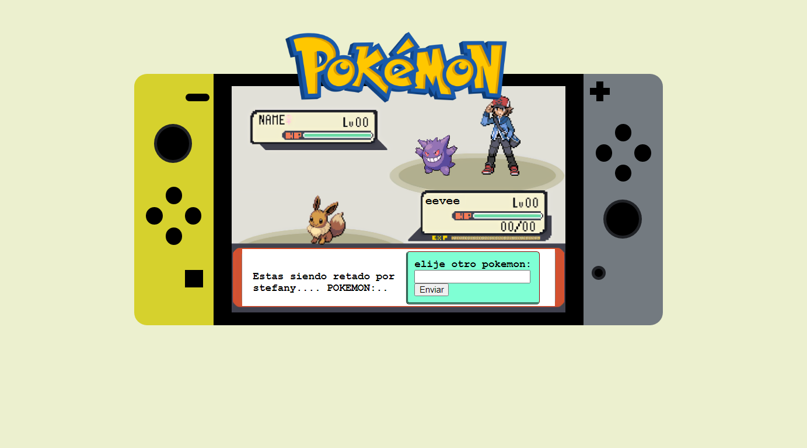

# pokeApi-game
Switch console with PokeApi  actions

## Usage

* Visit [pokeApi-game](https://stefanygonzalezleon.github.io/pokeApi-game/)
* Click on the pokemon string to search for your pokemon.
* Click on stats and moves to display them.

## Features

* fetch from the pokeApi.
* Input search to filter pokemon.

## Author

- [@stefanygonzalezleon](https://www.github.com/stefanygonzalezleon)
